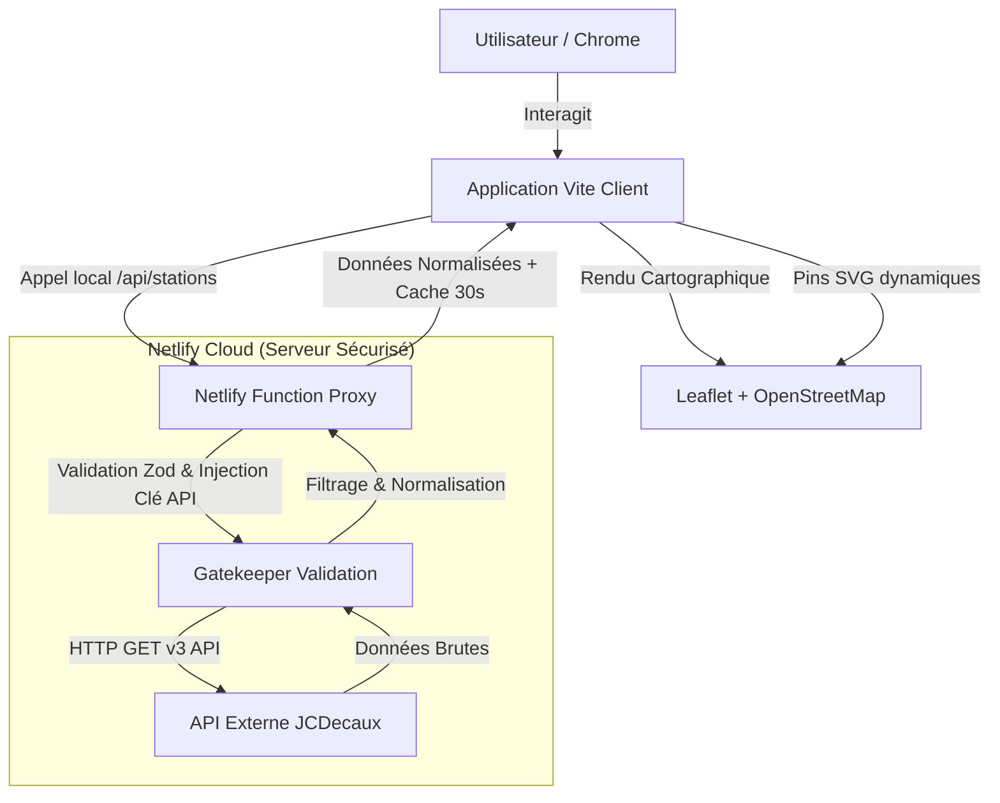

# BikeCity 🚲

<!-- Premium Badges and Labels -->
<div align="left">
  
  
  
  
  
  
</div>

<br />

**BikeCity** est une application web de cartographie de pointe permettant d'afficher les stations de vélos en libre-service en France en temps réel. 

Cette refonte majeure modernise une application JavaScript Vanilla rudimentaire en une application web professionnelle, hautement sécurisée, performante et prête pour le déploiement cloud sur Netlify, sans exposer aucune clé d'API côté navigateur.

<br>

> [!NOTE]
> ### 🎨 Aperçu Conceptuel de l'Application (Généré avec Banana)
> 
> *Cette illustration conceptuelle haut de gamme a été **générée avec l'outil de création visuelle Banana** pour s'harmoniser avec le code source et l'identité écolo-tech de BikeCity, représentant des lignes de code JavaScript lumineuses fusionnant avec des pins géolocalisés.*

<br>

---

<br>

## 🎯 Objectifs du Projet

1. **Migration vers Vite** : Compilation ultra-rapide des modules JavaScript ESM natifs.
2. **Protection de la Clé API** : Encapsulation totale de la clé JCDecaux derrière un proxy serverless.
3. **Mise à niveau API** : Intégration de la version moderne **v3** de l'API ouverte JCDecaux.
4. **Interface Responsive Premium** : Dashboard moderne structuré en grille CSS doté de pins SVG dynamiques.
5. **Hygiène de Code** : Validation stricte sous ESLint 9 et commentaires didactiques.

<br>

---

<br>

## 🏗 Architecture Globale

Le navigateur client n'interroge jamais directement JCDecaux. Il effectue des requêtes locales vers un proxy serverless hébergé par Netlify, garantissant l'anonymisation et le masquage des clés de sécurité :



> [!IMPORTANT]
> *Sous ce logigramme de l'architecture globale, il est **indispensable de retenir que le flux de données circule de manière étanche** grâce à l'intermédiaire du **serveur proxy serverless sécurisé de Netlify**.*

<br>

---

<br>

## 🛠 Stack Technique

| Technologie | Rôle dans l'Application | Avantage Majeur |
| :--- | :--- | :--- |
| **Vite** | Outil d'assemblage (Build Tool) | Chargement instantané et minification |
| **JavaScript Vanilla** | Logique applicative ESM native | Zéro surcharge de framework (React/Vue) |
| **Leaflet** | Moteur de rendu cartographique | Léger, interactif et hautement personnalisable |
| **OpenStreetMap** | Fond de carte (Tile Provider) | Libre de droits, précis et mondial |
| **Netlify Functions** | Proxy d'API Serverless | Masquage de clé API et bypass CORS |
| **Zod** | Validateur de schémas de données | Blocage en amont des entrées malveillantes |

<br>

---

<br>

## 💻 Installation & Lancement Local

### 1. Cloner le projet et installer les dépendances
```bash
npm install
```

### 2. Configurer les variables d'environnement
Créez un fichier `.env` local basé sur le modèle fourni :
```bash
cp .env.example .env
```
Renseignez votre clé d'API JCDecaux dans le fichier `.env` :
```env
JCDECAUX_API_KEY=your_secret_api_key_here
JCDECAUX_API_BASE_URL=https://api.jcdecaux.com/vls/v3
```

### 3. Lancer l'environnement de développement unifié
Cette commande exécute simultanément le serveur de développement Vite (Front) et les fonctions locales Netlify (Back) :
```bash
npm run dev
```
Ouvrez votre navigateur à l'adresse : **`http://localhost:8888`**

<br>

---

<br>

## 🛡 Focus Cybersécurité : Pourquoi la clé d'API ne doit pas résider dans le JavaScript client ?

Dans une application front-end traditionnelle, tout le code JavaScript envoyé au navigateur est entièrement visible par l'utilisateur final.

> [!CAUTION]
> Placer une clé API privée directement dans vos scripts ou dans des variables préfixées par `VITE_` revient à la publier publiquement.

### Les risques réels
- **Pillage des quotas** : N'importe qui peut extraire votre clé et l'utiliser pour saturer vos appels (Rate Limiting).
- **Usurpation d'identité** : Blocage ou révocation définitive de vos accès par le fournisseur (JCDecaux) en raison d'un usage abusif externe.
- **Surcoûts financiers** : Facturation à la requête pour votre compte en cas de spams.

### La parade appliquée
La clé API est stockée de manière sécurisée dans les variables d'environnement du serveur de Netlify.
Le navigateur appelle uniquement la route locale `/api/stations`. Le proxy serverless intercepte l'appel, vérifie la légitimité des requêtes à l'aide de **Zod**, ajoute la clé d'API secrète, interroge JCDecaux, nettoie les données inutiles, applique une politique de cache de 30 secondes et renvoie uniquement l'essentiel au client.

<br>

---

<br>

## 📂 Documentation Complète

Pour aller plus loin, explorez nos guides techniques rédigés de manière exhaustive dans le dossier `docs/` :

- 📖 [01-Présentation Générale](file:///g:/www/projects/js/BikeCityVanilla/docs/01-presentation.md)
- 🏗 [02-Diagrammes d'Architecture & Flux précis](file:///g:/www/projects/js/BikeCityVanilla/docs/02-architecture.md)
- 🛡 [03-Cybersécurité & Proxy Serverless](file:///g:/www/projects/js/BikeCityVanilla/docs/03-securite.md)
- 🚀 [04-Guide de Déploiement Cloud](file:///g:/www/projects/js/BikeCityVanilla/docs/04-deploiement.md)
- 📊 [05-Rapport d'Audit & Notation de Production](file:///g:/www/projects/js/BikeCityVanilla/docs/05-audit.md)

<br>

---

<br>

## 🏷 Métadonnées & Tags de Version

### Version courante du Projet : `v2.0.0`

### Tags du Projet
`#vite` `#leaflet` `#openstreetmap` `#jcdecaux` `#netlify-functions` `#zod` `#security-hardened` `#vanilla-js` `#responsive-dashboard` `#es-modules` `#eslint-9`
