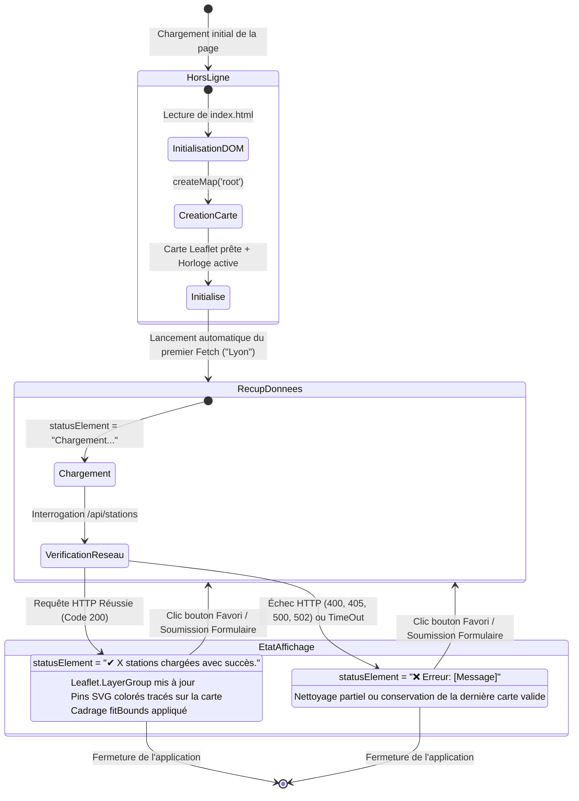
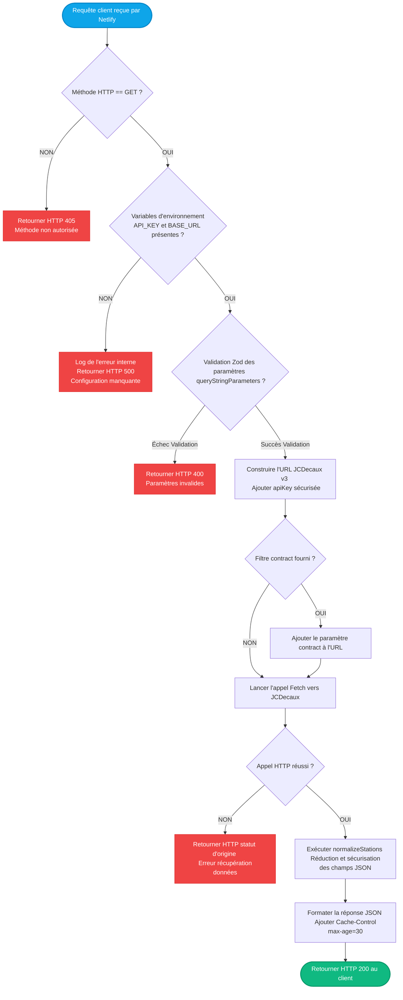

# BikeCity — Diagrammes d'Architecture & Flux

Ce document modélise avec une précision maximale le fonctionnement interne de **BikeCity**, depuis les interactions dans le navigateur de l'utilisateur jusqu'aux appels de l'API externe JCDecaux en passant par le proxy serverless de Netlify.

<br>

---

<br>

## 1. Diagramme de Séquence : Cycle de Vie d'une Requête

Ce schéma décrit de manière séquentielle le flux réseau établi lorsqu'un utilisateur interroge une ville (ex. clic sur le bouton favori Lyon ou envoi d'une recherche textuelle).

```mermaid
sequenceDiagram
    autonumber
    actor U as Utilisateur (Navigateur)
    participant DOM as Vue DOM (index.html)
    participant API as API Client (stations-api.js)
    participant NET as Proxy Netlify (netlify.toml)
    participant FNC as Function Serverless (stations.js)
    participant JCD as API Externe JCDecaux v3

    U->>DOM: Déclenche une recherche (Clic / Formulaire)
    DOM->>DOM: Met à jour le bandeau "#status" (Chargement...)
    DOM->>API: Appelle fetchStations("Lyon")
    
    API->>NET: Envoie HTTP GET /api/stations?contract=Lyon
    Note over NET: Réécriture d'URL interne<br/>via le fichier netlify.toml
    NET->>FNC: Route vers /.netlify/functions/stations?contract=Lyon
    
    rect rgb(30, 41, 59)
        Note over FNC: Exécution Côté Serveur (Secured)
        FNC->>FNC: Vérifie la méthode GET
        FNC->>FNC: Valide le paramètre "contract" (Zod Schema)
        FNC->>FNC: Récupère la clé API depuis process.env
        FNC->>JCD: Transmet HTTP GET /stations?contract=Lyon&apiKey=SECRET_KEY
    end
    
    JCD-->>FNC: Retourne la liste brute des stations (JSON v3)
    
    rect rgb(30, 41, 59)
        Note over FNC: Traitement des données
        FNC->>FNC: Filtre & Normalise la structure (normalizeStations)
        FNC->>FNC: Applique l'en-tête Cache-Control (30s)
    end
    
    FNC-->>NET: Réponse HTTP 200 (JSON Normalisé & Anonymisé)
    NET-->>API: Réponse HTTP 200 (JSON)
    API-->>DOM: Résout la Promesse avec le tableau des stations
    
    DOM->>DOM: Initialise/Réinitialise le LayerGroup Leaflet
    DOM->>DOM: Génère les pins SVG dynamiques (Vert/Orange/Rouge/Gris)
    DOM->>DOM: Ajuste la caméra de la carte (map.fitBounds)
    DOM->>DOM: Met à jour le bandeau "#status" (Succès)
    DOM-->>U: Affiche visuellement les stations sur la carte
```



> [!IMPORTANT]
> *Sous ce diagramme de séquence, il est **fondamental de comprendre que la clé d'API secrète reste confinée sur les serveurs de Netlify**, de sorte que **le navigateur client ne reçoit jamais la clé**.*

<br>

---

<br>

## 2. Diagramme d'État : Cycle de Vie de l'Interface

Ce diagramme d'état illustre la machine à états finis régissant l'interface utilisateur (UI) du front-end et gérant les transitions d'affichage en fonction des résultats des promesses JavaScript.



> [!TIP]
> *Dans ce diagramme d'état, il est **important de retenir que l'application réinitialise toujours proprement ses marqueurs de carte** à chaque transition d'état, évitant ainsi les **fuites de mémoire**.*

<br>

---

<br>

## 3. Flowchart : Logique Décisionnelle de la Netlify Function

Ce diagramme logique détaille de manière chirurgicale le cheminement décisionnel et les vérifications de sécurité menées à chaque appel réseau dans le proxy serverless `netlify/functions/stations.js`.



> [!CAUTION]
> *Dans ce logigramme, il est **crucial de noter que tout échec de validation Zod interrompt immédiatement la requête**, protégeant ainsi l'API externe JCDecaux contre les **requêtes malformées ou malveillantes**.*
```
